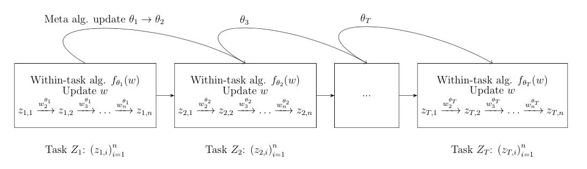

I currently hold a research assistant position at the [Istituto Italiano di Tecnologia](https://iit.it) in the [Computational Statistics and Machine Learning](https://www.iit.it/research/lines/computational-statistics-and-machine-learning) team, working with Professor [Massimiliano Pontil](https://scholar.google.com/citations?user=lcOacs8AAAAJ&hl=en). Previously I had a great remote collaboration with the [Approximate Bayesian Inference Team](https://team-approx-bayes.github.io "ApproxBayesTeam") of the [RIKEN Center for Advanced Intelligence Project](https://aip.riken.jp "RikenAIP"), working with [Pierre Alquier](https://pierrealquier.github.io) and [Emtiyaz Khan](https://emtiyaz.github.io). 

I graduated the Master [MVA](http://math.ens-paris-saclay.fr/version-francaise/formations/master-mva/) (Machine Learning and Computer Vision) from [ENS Paris Saclay](https://ens-paris-saclay.fr/en) and obtained the engineering degree of [ENSAE](https://www.ensae.fr/en/) specialising in Statistics. Prior to that, I received a BSc in Mathematics from the [Université Paris Dauphine](https://dauphine.psl.eu/en/) and spent a thrilling semester at the [University of Honk Kong](https://www.hku.hk). 

At RIKEN I worked mainly on the theoretical aspects of Generalized Variational Inference, (sequential) optimisation and meta learning. I'm also interested in Kernel Methods, Optimal Transport, Gaussian Processes and Reinforcement Learning.

Teaching
======
- Introduction to stochastic processes - Graduate (M1) - ENSAE Paris in Fall 2020 with [Nicolas Chopin](https://sites.google.com/site/nicolaschopinstatistician/)
- Tutor for first year students in Linear Algebra and Functional Analysis - Université Paris Dauphine in Fall 2017

Master's Thesis
======
 

[Meta Learning Meets Variational Inference, Learning Priors with Guarantees.](../files/RikenReport.pdf) Master's thesis (related preprint under preparation).

Education
======

[Curriculum Vitae](../files/MeunierDimitriResume.pdf)

- MSc in Statistics & Machine Learning, ENS Paris-Saclay, 2019-2020
- MSc in Statistics & Economics, ENSAE Paris, 2018-2020
- BSc in Mathematics, Université Paris Dauphine, 2014-2018

