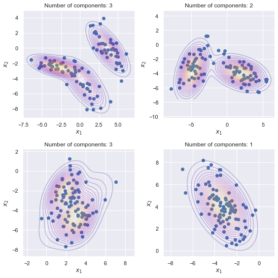

Hi, welcome to my homepage.

I am a first year PhD student in the [Gatsby Computational Neuroscience Unit](https://www.ucl.ac.uk/gatsby/study-and-work/phd-programme) at [UCL](https://www.ucl.ac.uk) and an [ELLIS](https://ellis.eu/phd-postdoc) PhD student.

Previously, I was a research assistant at the [Istituto Italiano di Tecnologia](https://iit.it) in the [Computational Statistics and Machine Learning](https://www.iit.it/research/lines/computational-statistics-and-machine-learning) team in Genoa, working with [Massimiliano Pontil](https://scholar.google.com/citations?user=lcOacs8AAAAJ&hl=en) and [Carlo Ciliberto](https://scholar.google.com/citations?user=XUcUAisAAAAJ&hl=en). From May 2020 to November 2020, I was a (remote) research intern with [Pierre Alquier](https://pierrealquier.github.io) and [Emtiyaz Khan](https://emtiyaz.github.io) in the [Approximate Bayesian Inference Team](https://team-approx-bayes.github.io "ApproxBayesTeam") of the [RIKEN Center for Advanced Intelligence Project](https://aip.riken.jp "RikenAIP") in Tokyo.

I graduated the Master [MVA](http://math.ens-paris-saclay.fr/version-francaise/formations/master-mva/) (Machine Learning and Computer Vision) from [ENS Paris Saclay](https://ens-paris-saclay.fr/en) and obtained the engineering degree of [ENSAE](https://www.ensae.fr/en/) specialising in Statistics. Prior to that, I received a BSc in Mathematics from the [Université Paris Dauphine](https://dauphine.psl.eu/en/) and spent a semester at the [University of Honk Kong](https://www.hku.hk). 

<!-- At RIKEN I worked on the theoretical aspects of Variational Inference and meta learning. My research interests span optimisation, reproducing kernel hilbert spaces, optimal transport and bayesian inference. I am particularly fond of functional analysis, measure and integration theory and high-dimensional probability.--> 

<!--Submitted preprints
====== -->

Conference
======
- [Z. Li](https://www.linkedin.com/in/zhu-l-145a2216a/?trk=public_profile_browsemap_profile-result-card_result-card_full-click&originalSubdomain=uk)\*, **D. Meunier**\*, [M. Mollenhauer](https://scholar.google.de/citations?user=nxIcGXwAAAAJ&hl=en), [A. Gretton](https://www.gatsby.ucl.ac.uk/~gretton/), Optimal Rates for Regularized Conditional Mean Embedding Learning, 2022, to appear in Advances in Neural Information Processing Systems 36 (NeurIPS). Available on [arXiv:2208.01711](https://arxiv.org/abs/2208.01711). (* Equal contribution)

<!--

  

     
  

  
 -->
- Distribution Regression with Sliced Wasserstein Kernels. **Meunier, D.**; [Pontil, M.](http://www0.cs.ucl.ac.uk/staff/m.pontil/); [Ciliberto, C.](https://cciliber.github.io) Proceedings of the 39th International Conference on Machine Learning (ICML), Proceedings of Machine Learning Research, 2022, vol. 162, pp. 15501--15523. Available on [arXiv:2202.03926](https://arxiv.org/abs/2202.03926).
<!--      

    
 -->
    
Journal
======
- [Meta-strategy for Learning Tuning Parameters with Guarantees](https://www.mdpi.com/1099-4300/23/10/1257). **Meunier, D.**; [Alquier, P.](https://pierrealquier.github.io/index.html) [arXiv:2102.02504](https://arxiv.org/abs/2102.02504), [Code](../files/supplement.zip). Entropy, 2021, vol. 23, no. 10, 1257. Part of the special issue on [Approximate Bayesian Inference](https://www.mdpi.com/journal/entropy/special_issues/approx_Bayes_inference).
 

Master's Thesis
======
- [Meta Learning Meets Variational Inference, Learning Priors with Guarantees.](../files/RikenReport.pdf) (2020)

Teaching
======
- Introduction to stochastic processes - Graduate (M1) - ENSAE Paris in Fall 2020 with [Nicolas Chopin](https://nchopin.github.io)
- Tutor for first year students in Linear Algebra and Functional Analysis - Université Paris Dauphine in Fall 2017

Education
======

[Curriculum Vitae](../files/MeunierDimitriResume.pdf)

- MSc in Statistics & Machine Learning, ENS Paris-Saclay, 2019-2020
- MSc in Statistics & Economics, ENSAE Paris, 2018-2020
- BSc in Mathematics, Université Paris Dauphine, 2014-2018

